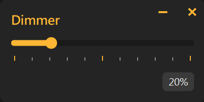

<div align="center">


# Dimmer

### A minimalistic screen dimmer for Windows

*Reduce eye strain and set the perfect ambiance with a simple dimmer overlay*

[](https://www.python.org/downloads/)
[](https://pypi.org/project/PyQt6/)
[](https://opensource.org/licenses/MIT)
[](https://www.microsoft.com/en-us/windows)

[✨ Features](#-features) • [🖼️ Preview](#%EF%B8%8F-preview) • [📖 Usage](#-usage) • [🚀 Installation](#-installation)
</div>

---

## ✨ Features

- **🖥️ Full-Screen Dimming** - Creates a semi-transparent overlay that dims your entire screen

- **🎛️ Intuitive Controls** - Easy-to-use slider with real-time percentage display (0-100%)

- **💾 Persistent Settings** - Automatically saves and restores your preferred opacity level

- **📱 System Tray Integration** - Minimize to system tray for unobtrusive operation

- **👁️ Colour Accuracy** - Excludes tint overlay from screen captures

- **🎨 Minimalistic UI** - Clean dark theme UI with smooth graphics

- **⚡ Lightweight** - Minimal resource usage with optimized performance

## 🖼️ Preview

### App Interface



## 📖 Usage

1. Run the application by  downloading the .exe in [Releases](https://github.com/ExxML/Dimmer/releases) or [manually installing the project](#-installation)

2. Adjust opacity using the slider (0% = no dimming, 100% = maximum dimming)

3. Hide the app window by clicking the minimize button

4. Show the app window by clicking the tray icon

5. Close the application by clicking the X button or quit via the system tray menu

6. *[Optional]* Set up auto-run on startup:
   - Create a shortcut for `dimmer.exe`
   - Move the shortcut to the Startup folder (open with `Win + R` and type `shell:startup`)

## 🚀 Installation

### Prerequisites
- Windows 10 or 11
- Python 3.12 (Nuitka compiler will not work with 3.13)

### Quick Setup

1. Clone the repository
   ```bash
   git clone https://github.com/ExxML/dimmer.git
   cd dimmer
   ```

2. Create virtual environment
   ```bash
   python -m venv .venv
   .venv\Scripts\activate
   ```

3. Install dependencies
   ```bash
   pip install -r requirements.txt
   ```

4. Run the application
   ```bash
   python src/dimmer.py
   ```

5. Compile .exe using Nuitka
   ```bash
   python -m nuitka --standalone --windows-icon-from-ico="public/Dimmer.ico" --windows-console-mode=disable --enable-plugin=pyqt6 --include-data-dir="config=config" --include-data-dir="public=public" src/dimmer.py
   ```

   **Note:** Win32 calls are used in this program to ensure the overlay stays on top. Windows Defender may flag this as a virus. Add `dimmer.exe` as an exclusion in `Settings > Privacy & Security > Windows Security > Virus & Threat Protection > Manage settings > Exclusions > Add an exclusion`.

## 📁 Project Structure
```
dimmer/
├── src/
│   ├── dimmer.py               # Main application and UI
│   └── overlay.py           # Screen overlay implementation
├── config/
│   └── opacity_config.json  # Persistent settings
├── public/
│   └── Dimmer.ico           # Application icon
└── requirements.txt         # Python dependencies
```

## 📄 License

This project is licensed under the MIT License.

---

<div align="center">
   <h4>🩵 Gentle screen dimming for visual comfort 🩵</h4>
</div>

